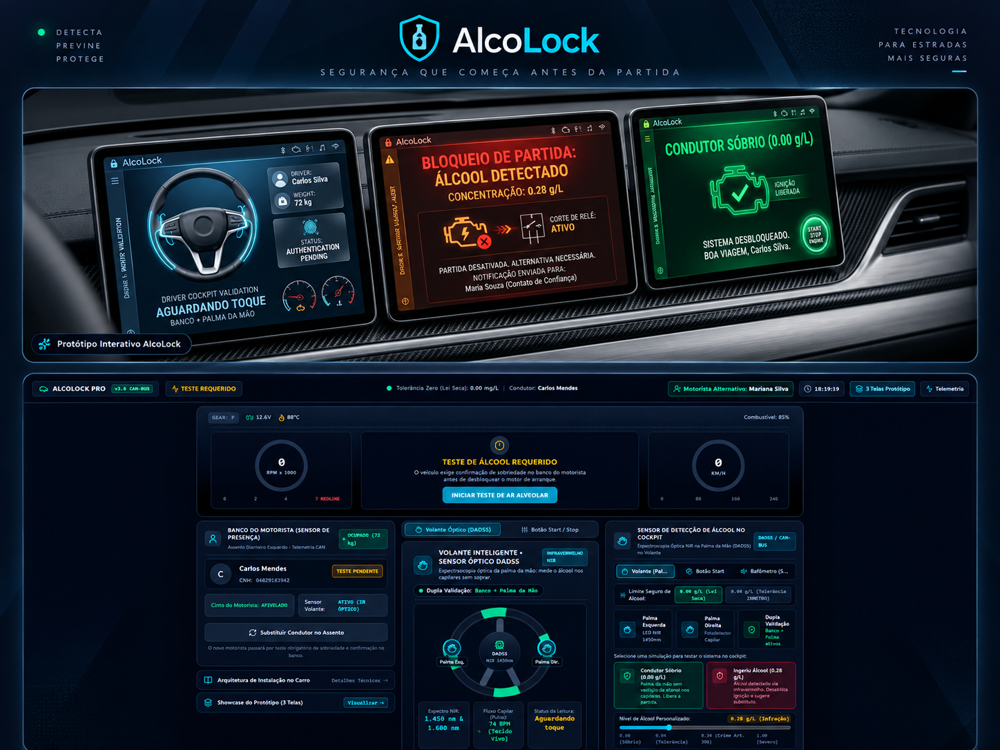
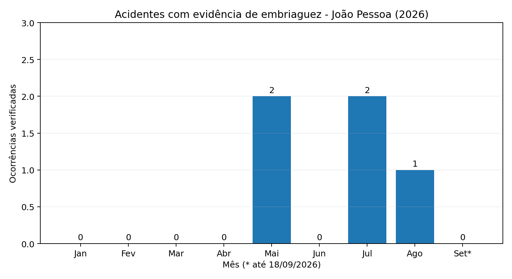

# 🚗 AlcoLock — Bloqueio Veicular Preventivo por Detecção de Álcool

> **Projeto acadêmico e experimental, desenvolvido com finalidade de aprendizagem.**
>
> O AlcoLock não é um sistema automotivo homologado, certificado ou pronto para instalação em veículos reais.

## 📌 Visão geral

O **AlcoLock** é um conceito de sistema preventivo de segurança veicular pensado para reduzir o risco de condução por uma pessoa que não seja aprovada na validação de álcool antes do início do deslocamento.

A proposta vai além de simplesmente detectar álcool e bloquear o veículo. O projeto também estuda como **sensores, software, experiência do usuário, localização e uma rede de contatos de confiança** podem trabalhar juntos para ajudar o motorista a encontrar uma alternativa segura.

A ideia central é:

```text
detectar risco
      ↓
impedir o início da condução
      ↓
explicar o que aconteceu
      ↓
oferecer alternativas seguras
      ↓
localizar um motorista substituto
      ↓
realizar nova validação
      ↓
liberar o veículo somente após aprovação
```

---

# 💡 Origem da ideia e pesquisa posterior

O AlcoLock nasceu como uma **ideia própria de projeto de aprendizagem**, a partir da reflexão sobre como reduzir o risco de uma pessoa iniciar a condução de um veículo após consumir álcool.

A concepção inicial do projeto surgiu **antes de eu ter conhecimento de pesquisas e iniciativas já existentes sobre detecção passiva de álcool em veículos**.

Somente depois de começar a desenvolver e pesquisar formas tecnicamente possíveis de implementar a ideia — incluindo sensores de ar, sensores por contato, identificação do motorista e alternativas para reduzir falsos positivos — tomei conhecimento de programas e estudos que investigam problemas semelhantes.

Essas referências passaram então a ser utilizadas para:

- compreender melhor a viabilidade técnica de determinados conceitos;
- identificar limitações que eu ainda não havia considerado;
- comparar diferentes formas de detecção;
- melhorar a documentação acadêmica do projeto;
- evitar apresentar como inédita uma tecnologia que já possui pesquisa anterior.

A existência dessas pesquisas **não foi a origem da concepção do AlcoLock**.

O projeto não utiliza código, arquivos, layouts, protótipos ou documentação interna de terceiros como base para sua concepção inicial. As fontes públicas citadas na documentação são utilizadas como **referências técnicas e bibliográficas posteriores**, para contextualizar tecnologias relacionadas e apoiar o processo de aprendizagem.

> Este registro tem finalidade de transparência sobre a evolução do projeto. Ele não representa, por si só, uma análise jurídica de originalidade, autoria, patenteabilidade ou propriedade intelectual.

Mais detalhes em [`docs/origem-e-pesquisa.md`](docs/origem-e-pesquisa.md).


---

## 🎯 Problema

Uma solução baseada exclusivamente em álcool presente no ar da cabine pode enfrentar situações de ambiguidade.

Exemplos:

- outros ocupantes do veículo também podem ter consumido álcool;
- o ambiente pode conter interferências;
- é necessário aumentar a confiança de que a leitura está associada ao motorista;
- leituras inconclusivas ou falsos positivos precisam ser tratados de forma segura;
- apenas bloquear o veículo não resolve a necessidade de o usuário retornar com segurança.

Por isso, o AlcoLock estuda uma arquitetura baseada em **múltiplas etapas de validação e recuperação segura da jornada**.

---

## 💡 Conceito da solução

Antes de permitir o início do deslocamento, o sistema deverá verificar as condições do motorista.

### Fluxo conceitual

```text
Motorista assume a posição de condução
               │
               ▼
       Validação do condutor
               │
               ▼
        Leitura dos sensores
               │
               ▼
          Análise do teste
               │
        ┌──────┴──────┐
        │             │
     Aprovado     Não aprovado
        │             │
        ▼             ▼
   Veículo pode    Bloqueio
 iniciar jornada       │
                       ▼
               Explicação clara
                       │
                       ▼
             Alternativas seguras
```

> O projeto prioriza **impedir o início de uma condução considerada insegura**. Não faz parte do conceito desligar abruptamente um motor com o veículo em movimento.

---

## 🧪 Estratégias de detecção estudadas

### 1. Detecção pelo ar

Sensores de álcool no ar podem ser utilizados em protótipos acadêmicos para estudar presença e concentração de vapores.

Entretanto, uma leitura de cabine isolada pode não ser suficiente para determinar com confiança qual ocupante originou a amostra.

Por isso, esse tipo de sensor deve ser tratado como **uma fonte de informação**, e não necessariamente como a única responsável pela decisão.

### 2. Detecção por toque

Outra linha estudada pelo projeto é a possibilidade de utilizar sensores de contato em componentes usados diretamente pelo motorista, como volante, botão de partida ou outro ponto de interação.

Existem pesquisas automotivas sobre **espectroscopia de tecido**, utilizando luz infravermelha para estimar álcool presente abaixo da superfície da pele.

No AlcoLock, essa tecnologia é tratada como **referência de pesquisa e possibilidade de evolução futura**, e não como funcionalidade atualmente implementada ou validada.

### 3. Sensor passivo integrado à cabeceira do banco

Uma nova linha de pesquisa do AlcoLock considera a utilização da **cabeceira do banco do motorista como ponto de coleta passiva do ar expirado**.

A proposta não é medir álcool diretamente pela pele do pescoço. O conceito é posicionar entradas de ar ou sensores na região da cabeceira, próxima à cabeça do condutor, para analisar o ar expirado naturalmente durante a respiração.

Em um estudo conceitual, esse módulo poderia combinar:

- detecção de CO₂, como indicador de presença de respiração humana;
- detecção de etanol no ar;
- temperatura e umidade;
- qualidade e estabilidade da amostra;
- ocupação do banco do motorista;
- posição aproximada do condutor.

Exemplo:

```text
          Motorista
        nariz / boca
             ↓
      ar expirado normal
             ↓
┌─────────────────────────┐
│ Cabeceira do motorista  │
│                         │
│ entrada de ar           │
│ CO₂                     │
│ etanol                  │
│ temperatura/umidade     │
└────────────┬────────────┘
             ↓
      análise do sinal
```

A hipótese é que a proximidade com o motorista possa ajudar a reduzir a influência de passageiros ou de álcool presente em outras regiões da cabine.

Entretanto, essa possibilidade precisa ser validada experimentalmente. Fluxo de ar, ventilação, posição da cabeça, distância, janelas abertas, ar-condicionado e movimentação dos ocupantes podem alterar significativamente uma leitura.

Por isso, a cabeceira deve ser tratada como **uma possível fonte adicional de dados**, e não como prova isolada de consumo de álcool.

### 4. Fusão de sensores

Uma evolução possível é combinar diferentes sinais para aumentar a confiabilidade da decisão.

Exemplo conceitual:

```text
ocupação do banco
        +
sensor passivo na cabeceira
(CO₂ + etanol + qualidade)
        +
sensor de contato no volante
        +
sensor ambiental da cabine
        +
consistência temporal
        ↓
motor de decisão
```

Exemplos de interpretação:

```text
Cabeceira:      CO₂ + etanol detectados
Volante:        leitura compatível
Cabine geral:   álcool baixo

→ sinais convergentes associados ao motorista
```

```text
Cabeceira:      leitura baixa/inconclusiva
Volante:        leitura baixa
Cabine geral:   álcool elevado

→ possível interferência ambiental ou de outro ocupante
→ não concluir automaticamente que o motorista ingeriu álcool
```

O objetivo da fusão não é produzir uma acusação automática, mas melhorar a qualidade da decisão e permitir estados como `INCONCLUSIVO` quando os sinais forem conflitantes.

---

## 🔐 Bloqueio preventivo

Caso o motorista não seja aprovado:

- o veículo permanece impossibilitado de iniciar a condução;
- o sistema informa claramente que a validação não foi aprovada;
- o usuário recebe opções de ajuda;
- outro motorista poderá ser chamado;
- o novo motorista deverá realizar sua própria validação;
- somente uma validação aprovada poderá prosseguir para a liberação.

### Resultado inconclusivo

Uma leitura inconclusiva **não deve ser apresentada como confirmação de embriaguez**.

O sistema deverá diferenciar pelo menos:

- `APROVADO`
- `NÃO APROVADO`
- `TESTE INCONCLUSIVO`
- `SENSOR INDISPONÍVEL`

Isso evita transformar uma falha técnica em uma afirmação incorreta sobre o usuário.

---

## 📍 Recuperação segura da jornada

Bloquear o veículo resolve apenas parte do problema.

Depois de impedir a condução, o usuário ainda precisa encontrar uma alternativa segura.

Por isso, o AlcoLock prevê uma **rede de contatos prioritários** previamente cadastrados.

Quando ocorrer um bloqueio, o sistema poderá oferecer:

- 📞 ligação para contato de confiança;
- 💬 envio de SMS ou mensagem compatível com a plataforma;
- 📍 compartilhamento da localização do veículo mediante configuração e consentimento;
- 🚗 solicitação para que outro motorista vá até o local;
- 🔄 novo teste quando o motorista substituto chegar.

### Exemplo de mensagem

> Não estou em condições de prosseguir como motorista neste momento. Preciso de ajuda para retornar com segurança. Minha localização poderá ser compartilhada conforme as permissões configuradas no aplicativo.

A redação final das mensagens deverá ser validada em testes de UX/CX para ser clara, respeitosa e não julgadora.

---

# 🧭 Jornada completa

```text
Tentativa de iniciar a condução
              │
              ▼
      Identificação/validação
              │
              ▼
       Leitura dos sensores
              │
         ┌────┴────┐
         │         │
     Aprovado   Não aprovado
         │         │
         ▼         ▼
     Liberação   Bloqueio
                   │
                   ▼
            Explicação ao usuário
                   │
                   ▼
             Opções de ajuda
                   │
       ┌───────────┼───────────┐
       ▼           ▼           ▼
    Ligação      Mensagem   Localização
       │           │           │
       └───────────┴───────────┘
                   │
                   ▼
        Motorista substituto chega
                   │
                   ▼
              Novo teste
                   │
             ┌─────┴─────┐
             ▼           ▼
         Aprovado    Não aprovado
             │
             ▼
          Liberação
```

---

# 🤝 Customer Experience (CX)

CX tem papel relevante no AlcoLock porque um sistema de segurança não precisa apenas tomar uma decisão técnica: ele precisa fazer com que o usuário **entenda o que ocorreu, saiba o que fazer e consiga concluir a situação com segurança**.

## Atuação de CX no projeto

- mapear a jornada antes, durante e depois de um bloqueio;
- identificar pontos de atrito;
- desenhar mensagens compreensíveis;
- evitar linguagem acusatória ou constrangedora;
- estruturar o fluxo de recuperação;
- reduzir confusão em resultados inconclusivos;
- projetar acessibilidade;
- realizar testes de usabilidade;
- analisar confiança e compreensão do sistema;
- estudar tratamento de falsos positivos;
- transformar feedback em melhorias de produto.

A pergunta de CX não é apenas:

> **“O sensor funcionou?”**

Também é:

> **“O usuário compreendeu a decisão, encontrou ajuda e conseguiu encerrar a jornada de forma segura?”**

---

# 🤝 Customer Success (CS)

No contexto do AlcoLock, Customer Success pode acompanhar se o usuário consegue configurar e utilizar corretamente os recursos que tornam o sistema útil.

Possíveis responsabilidades:

- onboarding;
- configuração inicial;
- cadastro de contatos prioritários;
- orientação sobre permissões de localização;
- educação sobre funcionamento e limitações;
- apoio em falhas e leituras inconclusivas;
- acompanhamento de dúvidas recorrentes;
- coleta estruturada de feedback;
- análise da adoção dos recursos de segurança;
- documentação e base de conhecimento.

Em um cenário futuro envolvendo frotas, locadoras, empresas ou instituições, CS também poderia acompanhar implantação, adesão, suporte, indicadores e melhoria contínua.

---

# 📊 Indicadores de CX/CS

Em protótipos e testes simulados, podem ser avaliados:

- taxa de conclusão do onboarding;
- percentual de usuários que configuram contatos de confiança;
- taxa de sucesso na execução das tarefas;
- tempo para compreender um bloqueio;
- tempo para encontrar a opção de ajuda;
- percentual de testes inconclusivos;
- ocorrência de falsos positivos em ambiente controlado;
- quantidade média de tentativas necessárias;
- taxa de sucesso no fluxo de motorista substituto;
- principais motivos de abandono;
- principais solicitações de suporte;
- CES (Customer Effort Score) em testes de usabilidade;
- CSAT após simulações não críticas.

> Métricas de experiência devem ser utilizadas para melhorar **segurança, clareza e confiabilidade**, e não para incentivar o usuário a contornar um bloqueio.

---

# 🔒 Privacidade e LGPD

O projeto poderá envolver informações como:

- identificação do usuário;
- contatos de confiança;
- localização;
- eventos do veículo;
- resultados dos sensores;
- registros de tentativas e validações.

Por isso, privacidade deve fazer parte do projeto desde a concepção.

Princípios propostos:

- minimização de dados;
- finalidade definida;
- transparência;
- controle de permissões;
- retenção limitada;
- proteção dos dados armazenados;
- autenticação;
- registros de auditoria quando necessários;
- compartilhamento de localização somente dentro de fluxos previstos;
- revisão da base legal adequada antes de qualquer implementação real.

Veja: [`docs/privacidade-seguranca.md`](docs/privacidade-seguranca.md).

---

# ⚠️ Segurança funcional

O AlcoLock é atualmente um projeto de estudo.

Qualquer integração futura com um veículo real exigiria conhecimentos e validações que vão além de software de aplicação, incluindo:

- engenharia automotiva;
- segurança funcional;
- confiabilidade de hardware;
- redundância;
- testes ambientais;
- calibração;
- requisitos regulatórios;
- tratamento de falhas;
- análise de riscos;
- homologação.

Não deve ser presumido que um protótipo acadêmico esteja apto a controlar um veículo real.

---

# 🧱 Arquitetura conceitual

```text
┌───────────────────────────┐
│       Motorista           │
└─────────────┬─────────────┘
              │
              ▼
┌───────────────────────────┐
│ Camada de identificação   │
└─────────────┬─────────────┘
              │
              ▼
┌───────────────────────────┐
│ Camada de sensores        │
│ ar / toque / contexto     │
└─────────────┬─────────────┘
              │
              ▼
┌───────────────────────────┐
│ Motor de decisão          │
└─────────────┬─────────────┘
              │
       ┌──────┴──────┐
       ▼             ▼
   Aprovado      Não aprovado
       │             │
       ▼             ▼
   Liberação      Bloqueio
                     │
                     ▼
┌───────────────────────────┐
│ Camada de assistência     │
│ contatos / localização    │
└─────────────┬─────────────┘
              │
              ▼
      Novo motorista/teste
```

Detalhes em [`docs/arquitetura-conceitual.md`](docs/arquitetura-conceitual.md).

---

# 🧪 Estratégia de validação

O desenvolvimento acadêmico pode avançar em etapas:

1. validar problema e jornada;
2. criar fluxos e wireframes;
3. criar protótipo navegável;
4. realizar testes de usabilidade;
5. simular eventos de sensores;
6. registrar estados e decisões;
7. criar protótipo físico isolado do veículo;
8. medir falhas e leituras inconclusivas;
9. revisar privacidade;
10. documentar limitações e aprendizados.

Nenhuma dessas etapas pressupõe instalação em veículo real.

---


---

# 🖥️ Protótipo inicial

O AlcoLock já possui um **protótipo inicial em desenvolvimento**, criado para explorar a experiência do usuário, os fluxos de validação e as funcionalidades previstas para o sistema.

Nesta fase, o protótipo representa uma versão preliminar e poderá sofrer alterações conforme avancem os estudos técnicos, os testes de usabilidade, a análise de sensores e as decisões de UX/CX.

<p align="center">
  
</p>

### O que esta versão busca demonstrar

- fluxo inicial de interação com o sistema;
- conceito de validação do motorista;
- bloqueio preventivo da condução;
- orientação ao usuário após uma não aprovação;
- base para acionamento de contatos de confiança;
- apoio à localização e recuperação segura da jornada;
- aplicação de UX e Customer Experience;
- estrutura inicial para futuras integrações com sensores;
- evolução da experiência antes da implementação de hardware real.

> 🚧 **Status:** protótipo em desenvolvimento. As telas, fluxos e funcionalidades ainda poderão sofrer alterações conforme o projeto evoluir.

O protótipo não representa um sistema automotivo homologado ou pronto para instalação em veículos reais. Ele é utilizado como ferramenta de aprendizagem, validação de fluxos e desenvolvimento conceitual do AlcoLock.

# 🔮 Roadmap

## Fase 1 — Definição
- [x] problema e objetivo do projeto;
- [x] conceito de bloqueio preventivo;
- [x] motorista substituto;
- [x] contatos prioritários;
- [x] papel de CX/CS;
- [ ] personas e cenários;
- [ ] requisitos funcionais e não funcionais.

## Fase 2 — UX/CX
- [ ] fluxo completo;
- [ ] wireframes;
- [ ] protótipo de alta fidelidade;
- [ ] acessibilidade;
- [ ] testes de usabilidade;
- [ ] revisão das mensagens.

## Fase 3 — Software
- [ ] cadastro de usuário;
- [ ] contatos de confiança;
- [ ] permissões de localização;
- [ ] estados de validação;
- [ ] simulação de bloqueio;
- [ ] histórico de eventos;
- [ ] fluxo do motorista substituto.

## Fase 4 — Protótipo IoT
- [ ] definição do hardware experimental;
- [ ] leitura de sensor em bancada;
- [ ] calibração experimental;
- [ ] integração com aplicação;
- [ ] registro de telemetria;
- [ ] testes controlados.

## Fase 5 — Validação
- [ ] testes de falsos positivos;
- [ ] testes de falsos negativos;
- [ ] testes de leituras inconclusivas;
- [ ] testes de falha de sensor;
- [ ] revisão de privacidade/LGPD;
- [ ] documentação dos resultados.

Veja o roadmap detalhado em [`docs/roadmap.md`](docs/roadmap.md).

---

# 📁 Estrutura documental

```text
AlcoLock/
├── README.md
└── docs/
    ├── arquitetura-conceitual.md
    ├── cx-cs.md
    ├── privacidade-seguranca.md
    ├── roadmap.md
    ├── testes-validacao.md
    ├── referencias.md
    └── origem-e-pesquisa.md
```

A estrutura de código existente pode permanecer separada desta documentação.

---

# 🎓 Objetivos de aprendizagem

O projeto permite estudar a integração entre:

- desenvolvimento de software;
- IoT e sensores;
- análise de requisitos;
- UX/UI;
- Customer Experience;
- Customer Success;
- dados;
- segurança;
- privacidade;
- documentação técnica;
- testes e validação.

O foco não é apresentar o AlcoLock como produto pronto, mas **documentar a evolução de uma ideia multidisciplinar, os problemas encontrados, as decisões tomadas e os aprendizados obtidos**.

---

# 📚 Documentação

- [Arquitetura conceitual](docs/arquitetura-conceitual.md)
- [CX e CS](docs/cx-cs.md)
- [Privacidade e segurança](docs/privacidade-seguranca.md)
- [Roadmap](docs/roadmap.md)
- [Testes e validação](docs/testes-validacao.md)
- [Referências](docs/referencias.md)
- [Origem da ideia e pesquisa](docs/origem-e-pesquisa.md)

---

# 📌 Status

**Em desenvolvimento — projeto acadêmico/de aprendizagem.**

As funcionalidades descritas representam uma combinação de:

- conceitos definidos;
- recursos planejados;
- hipóteses de pesquisa;
- possíveis evoluções.

Cada item deverá ser marcado como implementado somente após existir evidência no projeto.

---

## 👩‍💻 Autoria

Projeto desenvolvido por **Priscilla Cahino** como parte de estudos e desenvolvimento de competências em tecnologia, experiência do usuário, dados, processos e segurança.


---

## 📊 Pesquisa ampliada - acidentes e embriaguez em João Pessoa (2026)

A pesquisa documental foi revisada para não depender apenas do termo **sinistro**. Também foram consultados acidentes, colisões, atropelamentos, batidas e capotamentos associados a teste positivo, sinais de embriaguez, recusa ao etilômetro, autuação formal ou conclusão de investigação policial.

No período de **01/01/2026 a 18/09/2026**, foram localizados **5 acidentes em João Pessoa** com evidência pública suficiente para a base principal. As fontes registram pelo menos **4 pessoas feridas e 1 morte** nesses cinco eventos. Há ainda um caso de suspeita circunstancial mantido separadamente, sem entrar nos totais principais.

> Os números representam ocorrências publicamente verificáveis encontradas no levantamento, e não um censo oficial. Embriaguez confirmada e causalidade do acidente são campos separados na base.

- [Pesquisa ampliada](docs/pesquisa_ampliada_acidentes_embriaguez_joao_pessoa_2026.md)
- [Base de ocorrências](data/ocorrencias_ampliadas_joao_pessoa_alcool_2026.csv)
- [Relatório técnico em PDF](docs/AlcoLock_Relatorio_Tecnico_Pesquisa_Ampliada_2026.pdf)



